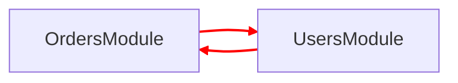

# NestJS Circular Dependency Resolver

Diagnose, fix, and prevent circular dependencies in NestJS — especially in
large monolithic projects with DDD-style bounded contexts.

## When to Use

- NestJS app fails to start with "A circular dependency" or "Nest cannot resolve dependencies"
- Module architecture review reveals tightly coupled services
- Refactoring NestJS modules to enforce clean dependency boundaries (DDD, hexagonal)
- Adding CI gates to prevent future circular dependency regressions
- User pastes a NestJS DI error and needs diagnosis

## When NOT to Use

- TypeORM/Prisma bidirectional entity relations — these are NOT module-level circular deps
- Non-NestJS projects — this skill is NestJS-specific
- Simple import errors that are not circular (missing exports, wrong paths)
- Performance or runtime bugs unrelated to dependency injection

## Workflow

1. **Diagnose** → 2. **Visualize** → 3. **Fix** → 4. **Verify** → 5. **Harden**

Skip steps as needed. Error pasted? Start at 1. Prevention advice? Jump to 5.

---

## 1. Diagnose

**Project starts:** Install `nestjs-spelunker` and run the bundled analysis script:

```bash
<pm> add nestjs-spelunker -D
<pmx> ts-node ${CLAUDE_SKILL_DIR}/scripts/spelunker-analyze.ts --mermaid
```

Detect the project's package manager and runner from the lockfile:

| Lockfile | Install (`<pm>`) | Run (`<pmx>`) |
|----------|-----------------|---------------|
| `package-lock.json` | `npm` | `npx` |
| `pnpm-lock.yaml` | `pnpm` | `pnpm exec` |
| `yarn.lock` | `yarn` | `yarn` |
| `bun.lockb` | `bun` | `bunx` |

Or use the inline snippet (add temporarily to `main.ts`):

```typescript
import { SpelunkerModule } from 'nestjs-spelunker';
const app = await NestFactory.createApplicationContext(AppModule, { logger: false });
const tree = SpelunkerModule.explore(app);
const root = SpelunkerModule.graph(tree);
const edges = SpelunkerModule.findGraphEdges(root);
console.log('graph LR');
edges.forEach(({ from, to }) => console.log(`  ${from.module.name}-->${to.module.name}`));
await app.close();
```

Filter noisy framework modules with `ignoreImports`:
```typescript
SpelunkerModule.explore(app, {
  ignoreImports: [/^TypeOrmModule$/, /^ConfigModule$/, /^CacheModule$/],
});
```

Flags: `--json` (machine output), `--mermaid` (diagram), `--debug` (provider-level DI resolution).
Set `APP_MODULE_PATH` env if root module is not at `./src/app.module`.

**Project won't start:** NestJS error message itself names the cycle. User
pastes error + module/service code — analyze directly without running spelunker.

---

## 2. Visualize

Generate Mermaid diagram. Highlight cycle edges in red.



For large projects, group by bounded context using `subgraph`.

---

## 3. Fix

Pick the highest-ranked strategy that fits. Read [references/fix-strategies.md](references/fix-strategies.md)
for decision flowchart, DDD context, and code examples.

| # | Strategy | When |
|---|----------|------|
| 1 | **Extract Shared Module** | Both modules need the same entity/DTO |
| 2 | **Orchestrator Module** | Cross-module workflow — create higher-level module that imports both |
| 3 | **Event-Based Decoupling** | Fire-and-forget side effects (EventEmitter2 or @nestjs/cqrs) |
| 4 | **DIP with Abstract Class** | Service A needs narrow slice of Service B — abstract class as injection token |
| 5 | **Facade** | Reduce coupling surface — export one facade service per module |
| 6 | **forwardRef()** | Last resort. Always flag as tech debt |

For each fix, generate before/after code. Include full file paths. Preserve
existing functionality — pure refactors only. Produce files in dependency
order (shared modules first).

---

## 4. Verify

Run in order:

1. `<pmx> tsc --noEmit` — no circular reference warnings
2. `<pmx> nest start` — boots without DI errors
3. Re-run spelunker — zero cycles in runtime graph
4. `<pmx> madge --circular --extensions ts src/` — no file-level import cycles
5. Existing tests pass

If any step fails, trace the root cause and fix before proceeding.

---

## 5. Harden

Read [references/prevention-patterns.md](references/prevention-patterns.md) for full patterns. Key points:

**Layered hierarchy:** Modules import only from same or lower layer.
Features → Domain → Infrastructure → Core. Never upwards.

**Barrel file discipline:** Never import from own barrel. Never barrel-export
module classes or providers. Keep barrel exports minimal.

**CI gates:**
```bash
<pmx> madge --circular --extensions ts src/ && echo "OK" || exit 1
```

**Linter rules:** If the project uses ESLint, enable `import/no-cycle` with `maxDepth: 3`.
If the project uses Biome, enable `noImportCycles` in `biome.json`.

---

## Output format

1. Markdown analysis — cycles found, root causes, chosen strategies
2. Mermaid diagrams — before (cycles red) and after (resolved)
3. Corrected `.ts` files with full paths

---

## Edge cases

- **TypeORM/Prisma bidirectional entity relations** are NOT circular
  dependencies at the module/DI level. Do not flag them.
- **`@Global()` modules** hide dependencies — avoid except for config/logging.
- **Dynamic modules** (`forRoot`/`forRootAsync`) can hide deps from static
  analysis. Spelunker catches these; madge does not.
- **Barrel files** are the #1 source of hidden file-level cycles.
- **Testing:** `Test.createTestingModule()` may surface CD differently — mock
  the dependent service.
